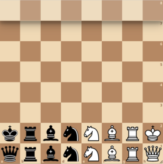

# Alpha Zero Racing Kings

This repo contains a python 3.8 implementation of the
[Alpha Zero](https://en.wikipedia.org/wiki/AlphaZero) general-purpose reinforcement learning
algorithm for the [Racing Kings](https://brainking.com/en/GameRules?tp=125) Chess variant.
The implementation is modular and can easily be adapted for other chess variants that are supported
by the python-chess library.
<br> </br>


## Racing Kings

The goal in this variant is to reach any square in the 8th rank with your king. Whoever gets there
first, wins the game (unless white reaches it first and black can reach it in his next move, then
it's a draw). No checks are allowed. Hence, walking into a check is also illegal. The starting
board looks like this:

<p align="center">
  
</p>

From personal experience, the average length of Racing Kings game for high rated players is
~15 moves. The number of legal actions per position is significantly smaller than that of regular
Chess. This makes the Racing Kings variant a much easier game to master, than regular Chess.
<br> </br>


## Alpha Zero

AphaZero is a computer program developed by Artificial Intelligence research company DeepMind to
master the games of Chess, Shogi and Go. It uses an algorithm very similar to that of
[AlphaGoZero](https://www.nature.com/articles/nature24270.epdf?author_access_token=VJXbVjaSHxFoctQQ4p2k4tRgN0jAjWel9jnR3ZoTv0PVW4gB86EEpGqTRDtpIz-2rmo8-KG06gqVobU5NSCFeHILHcVFUeMsbvwS-lxjqQGg98faovwjxeTUgZAUMnRQ).
The original paper by DeepMind can he found [here](https://arxiv.org/abs/1712.01815). In this repo,
the implementation of Alpha Zero is the same as described in the paper. Of course,
some modifications have been made in the state and action representations in order to match the
Racing Kings variant.

### Self Play
Unless you have access to a supercluster, self-play will be way too slow. The functionality has
been implemented, but it's just not practical if you do not have the resources to train.
The process takes time because the agent has to figure out the game by himself (i.e. checkmate the
opponent by moving randomly).

### Supervised Learning
Since self-play is costly, supervised learning has also been implemented in order to speed up
training. This means that human knowledge is being inserted in the model, which wonders off the
world of Alpha Zero. That's why it is a separate method, and can be omitted. The
[database](https://database.lichess.org/#variant_games) used is from
[lichess.org](https://lichess.org/), and can be downloaded locally using the
[download bash script](./download_racing_kings_data.sh).
<br> </br>


# Repository Structure

## Configurations
All the configuration files are located in the [configurations](./configurations). They are used
for running the main scripts. They can easily be edited manually, but make sure that the data types
are correct.

## Source Code
The source code for the project is located in the [src](./src) python package. The code is
organized in the following modules:

- [Agent](./src/agent): Contains an [implementation](./src/agent/chess_agent.py) of the Alpha Zero
  Chess Agent.
- [Datasets](./src/datasets): Contains implementations of torch class Datasets used during training.
- [Environment](./src/environment): This package contains 2 sub-packages:
  - [Variants](./src/environment/variants): Contains the
    [base class](./src/environment/variants/base_chess_env.py) for a Chess environment, and the
    variants that have been implemented and inherit the base class (so far, only
    [Racing Kings](./src/environment/variants/racing_kings.py)).
  - [Actions](./src/environment/actions): Contains the
    [base class](./src/environment/actions/action_representations.py) for representing Chess actions
    (move), which is used as an interface between the environment and the agent, and an
    implementation for every Chess variant available (again, so far only
    [Racing Kings](./src/environment/actions/racing_kings_actions.py)).
- [Monte Carlo Tree Search](./src/monte_carlo_search_tree): Contains an
  [implementation](./src/monte_carlo_search_tree/mcts.py) of the
  [Monte Carlo Tree Search](https://en.wikipedia.org/wiki/Monte_Carlo_tree_search) algorithm used in
  the Alpha Zero algorithm, as described in the paper. 
- [Neural Network](./src/neural_network): Contains a
  [PyTorch implementation](./src/neural_network/network.py) of the Neural Network used in the
  Alpha Zero algorithm. The architecture can be configured from the configuration files.
- [Utilities](./src/utils): Contains different utility functions.
- Main scripts: [Train script](./src/train.py), [Evaluation script](./src/evaluate.py) and
  [Training Supervised script](./src/train_supervised.py).

## Tests
Unit Tests have been implemented in the [tests](./tests) directory to make sure that no
functionalities break when adding new features.
<br> </br>


# Usage

Activate a virtual environment and install the required python libraries:
```bash
$ conda activate venv
$ pip install -r requirements.txt
```

## Self Play training
In order to train your agent with self play, use the following commands:
```bash
$ cd src
$ python3 train.py --train-config    [path_to_train_configuration_file]
                   --nn-config       [path_to_neural_network_configuration_file]
                   --nn-checkpoints  [path_to_directory_to_save_nn_weights]
                   --mcts-config     [path_to_monte_carlo_tree_search_configuration_file]
                   --device          [cpu | cuda]
```
**Note**: The [*path_to_directory_to_save_nn_weights*] must be pointing to an already existing
directory.

An example of running the [train script](./src/train.py) can be:
```bash
$ python3 train.py --train-config ../configurations/training_hyperparams.ini
                   --nn-config ../configurations/neural_network_architecture.ini
                   --nn-checkpoints ../models/checkpoints
                   --mcts-config ../configurations/mcts_hyperparams.ini
                   --device cpu
```

## Evaluation (playing against the agent)
In order to play against the agent, you must have trained him and stored the weights of the NN in a
specific file. To play against him, use the command:
```bash
$ cd src
$ python3 evaluate.py --nn-config            [path_to_neural_network_configuration_file]
                      --pre-trained-weights  [path_to_file_with_NN_weights]
                      --mcts-config          [path_to_monte_carlo_tree_search_configuration_file]
                      --device               [cpu | cuda]
                      --white
```
The last flag (--white) determines the color of the user. If specified, the user will have the white
pieces. Else, if omitted, the user starts with the black pieces.

**Note**: For the visualization of the board, the python
[chess-board library](https://github.com/ahira-justice/chess-board) has been used. It has some minor
issues, that can be easily solved by following the steps in the docstring of the
[Base Chess Environment](./src/environment/variants/base_chess_env.py) script. If the user does not
wish to use a display (and therefore deal with this matter), the parameter *--no-display* can be
specified.

An example of running the script is:
```bash
$ python3 evaluate.py --nn-config ../configurations/neural_network_architecture.ini
                      --pre-trained-weights ../models/checkpoints/iteration_0_weights.pth
                      --mcts-config ../configurations/mcts_hyperparams.ini
                      --device cpu
                      --white
                      --no-display
```

## Supervised Training
In order to train the agent using Supervised Learning, first you have the download the data files
(.png) from lichess. You can use the following bash script to do so:
[download_racing_kings_data](./download_racing_kings_data.sh).
After the data has been downloaded (suppose in the *./Dataset* directory), to train the agent
(first with supervised learning, then with self play), run the commands:
```bash
$ cd src
$ python3 train_supervised.py
  --train-config                  [path_to_train_configuration_file]
  --nn-config                     [path_to_neural_network_configuration_file]
  --nn-checkpoints                [path_to_directory_to_save_nn_weights]
  --supervised-train-config       [path_to_supervised_train_configuration_file]
  --data-root-directory           [path_to_the_root_directory_containing_data]
  --parsed-data-destination-file  [path_to_store_data_once_parsed]
  --mcts-config                   [path_to_monte_carlo_tree_search_configuration_file]
  --device                        [cpu | cuda]
```
An example:
```bash
$ python3 train_supervised.py
  --train-config ../configurations/training_hyperparams.ini
  --nn-config ../configurations/neural_network_architecture.ini
  --nn-checkpoints ../models/checkpoints
  --supervised-train-config ../configurations/supervised_training_hyperparams.ini
  --data-root-directory ../Dataset
  --parsed-data-destination-file ../Dataset/parsed_data.pickle
  --mcts-config ../configurations/mcts_hyperparams.ini
  --device cpu
```
**Note**: If the data has already been parsed once (it takes ~2 hours), then instead of re-parsing
it when running again the supervised training script, the parameter
*--parsed-data [path_to_parsed_data_file]* can be specified, to directly load the parsed data,
like so:

```bash
$ python3 train_supervised.py
  --train-config ../configurations/training_hyperparams.ini
  --nn-config ../configurations/neural_network_architecture.ini
  --nn-checkpoints ../models/checkpoints
  --supervised-train-config ../configurations/supervised_training_hyperparams.ini
  --parsed-data ../Dataset/parsed_data.pickle
  --mcts-config ../configurations/mcts_hyperparams.ini
  --device cpu
```
<br> </br>


# Future Work - Possible Ideas & Improvements

For future work, in order to further improve the algorithm, the following ideas can be implemented:

1. Optimize the code - Make it MultiThreaded (simultaneously execute episodes of self play in the
   same iteration).
2. Add a Curriculum Learning mechanism: sample endgame positions (could be random ones, but
   preferably from human data), and make the agent first play on these positions in order to
   discover positive rewards (i.e. checkmate) earlier, and therefore speed up learning. The paper
   describing this idea can be found [here](https://arxiv.org/abs/1903.12328).
3. Implement Monte Carlo Graph Search instead of the regular Tree Search. In this approach, the
   search tree is generalized to an acyclic graph, grouping together similar positions and hence
   reducing significantly the state space. The paper describing this approach can be found
   [here](https://arxiv.org/abs/2012.11045).
<br> </br>


# Contributing - Adding more Variants

The code is very flexible. The Alpha Zero agent and the Monte Carlo Tree Search classes have been implemented to be compatible with any Chess environment that inherits from the [Base Chess Environment](./src/environment/variants/base_chess_env.py), and any action-translator that inherits from the [Move Translator](./src/environment/variants/base_chess_env.py). Thus, to add a new variant, you have to follow the next 3 steps:

   1. Create a Wrapper class for that variant, that uses the [Python-Chess library](https://python-chess.readthedocs.io/en/latest/), like the one already implemented for Racing Kings [here](./src/environment/variants/racing_kings.py).
   2. Create a MoveTranslator class for that variant, like the one implemented [here](./src/environment/actions/racing_kings_actions.py).
   3. Adjust the main scripts ([train.py](./src/train.py), [evaluate.py](./src/evaluate.py) and [train_supervised.py](./src/train_supervised.py)) to use the classes of the variant you just implemented in the previous 2 steps.
  
Feel free to contribute.
